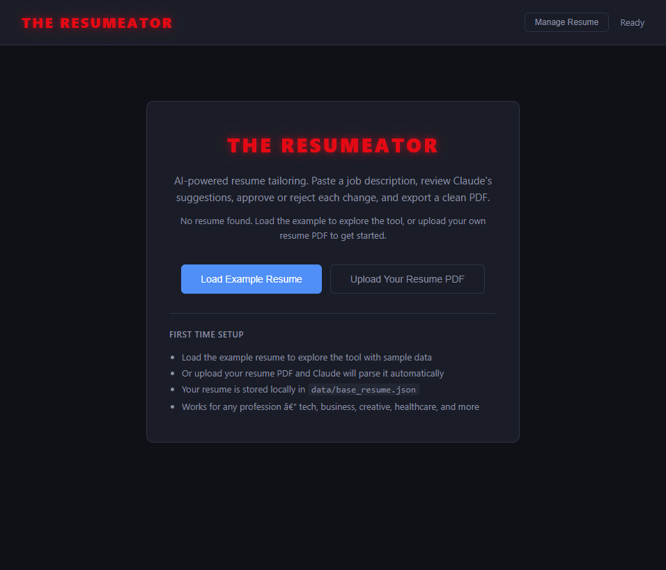
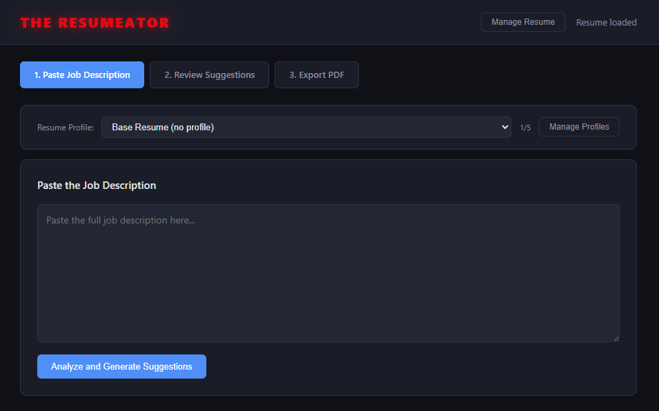
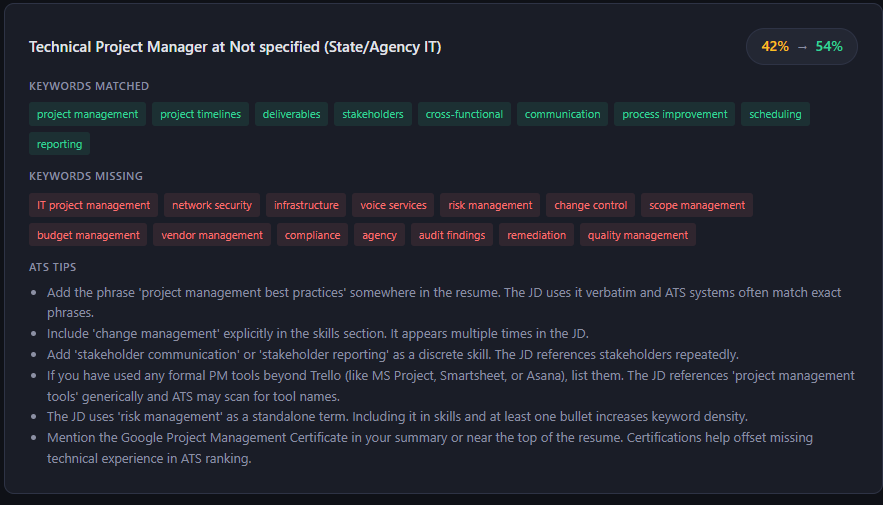
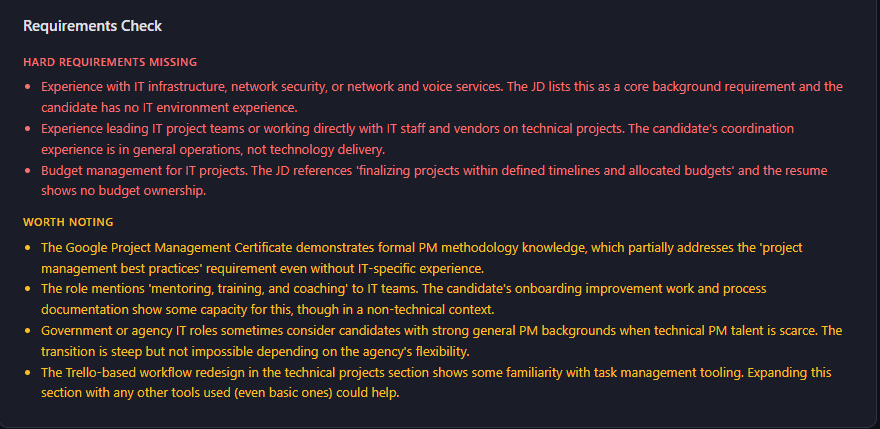
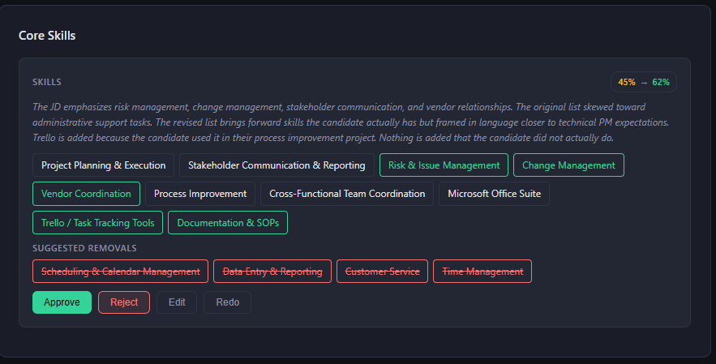
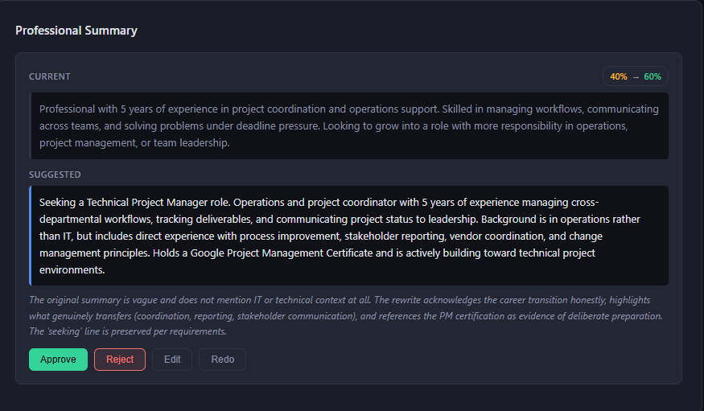
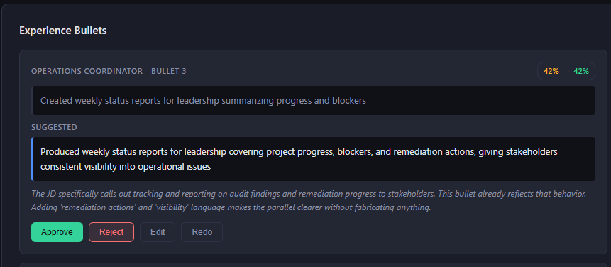
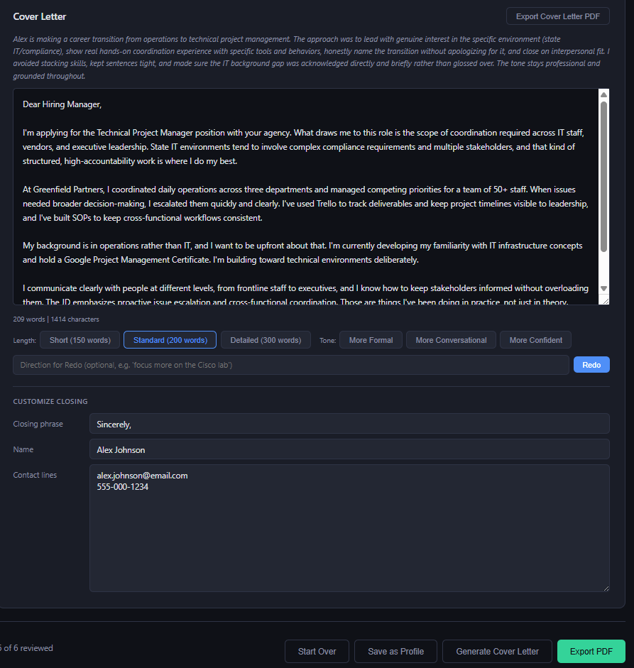
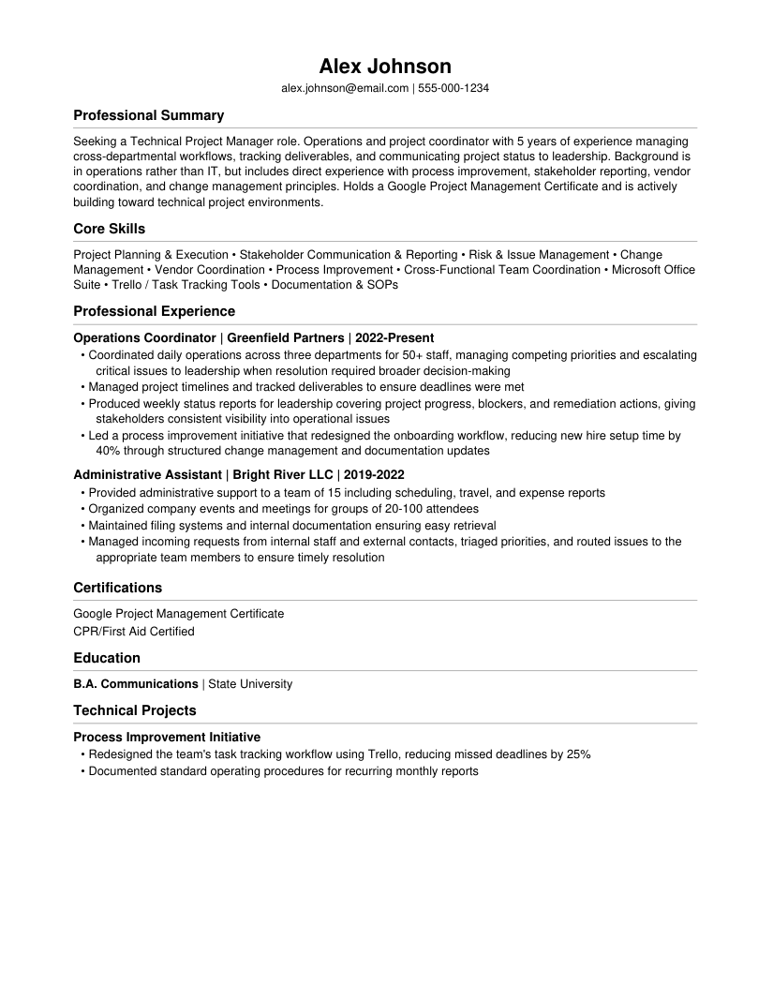
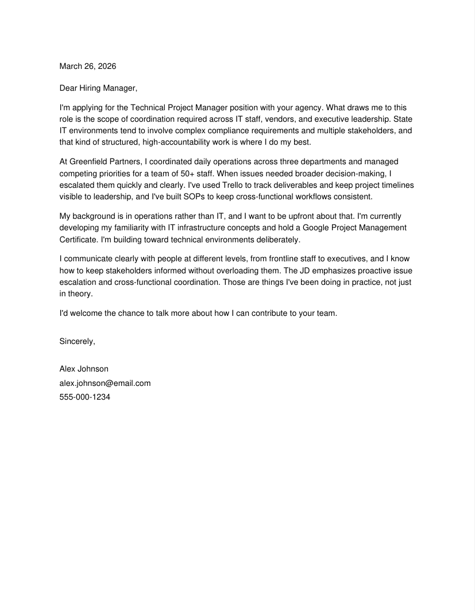

# THE RESUMEATOR


**"I'll be back... with a tailored resume."**

An AI-powered resume and cover letter tailoring agent that analyzes job descriptions, suggests targeted changes, and exports clean PDFs. You review, approve, edit, or reject every suggestion before anything goes on paper. No AI slop. No buzzword bingo. Just a sharp resume that sounds like you wrote it.

Built by a career transitioner who got tired of manually rewriting the same resume 50 different ways. Works for any profession, whatever you do.

---

## What It Does
Im using a random project manager role for this example. It can work with anything. Please remember to upload a resume with minimal design. No fancy fonts. No weird tables. Keep it simple spend sometime on the fisrt one to make yourself sound as good as you can. THE RESUMEATOR works off of your input. 

1. **Paste a job description** into the web UI 

2. **The Resumeator parses the JD** into structured requirements (skills, tools, certs, experience)

3. **Analyzes your resume** against those requirements with gap analysis and match scoring


4. **Review every suggestion** approve, reject, edit inline, or ask for a redo


6. **Generate a tailored cover letter** with full editing controls

7. **Preview and export** matching PDFs ready to submit



No changes happen without your approval.

---

## Features

**JD Intelligence**
- Automatically parses job descriptions into structured data before analysis
- Extracts required skills, preferred skills, tools, certifications, experience level, and security requirements
- Color-coded requirements breakdown: green (required), yellow (preferred), blue (tools)
- Cleaner data means better suggestions and lower API costs

**Resume Tailoring**
- Professional summary rewrite suggestions targeted to each role
- Core skills reordering and keyword matching against the job description
- Experience bullet rewrites focused on highest-impact changes only
- Before/after match scores so you can see what each change is worth
- Requirements check: hard gaps (red) vs flexible items (yellow) so you know if it's worth applying
- Experience gap analysis showing exactly where you're strong and where you have gaps
- Every suggestion explains which specific JD requirement it addresses

**Reality Mode**
- Three tone settings: Honest, Balanced, or Aggressive
- Honest: conservative, accurate, no exaggeration
- Balanced: moderate confidence, professional tone (default)
- Aggressive: strong action verbs, confident phrasing, still factual
- Applies to both resume suggestions and cover letter generation

**Cover Letter Generation**
- Generates after you're happy with the resume
- Full editing in the browser with live word count
- Length controls: Short (150 words) / Standard (200 words) / Detailed (300 words)
- Tone controls: Formal / Conversational / Confident
- Redo with feedback ("focus more on the lab experience")
- Customizable closing block (sign-off, name, contact info)
- Structured format: interest, experience, transition, fit, closing
- Sounds like a real person, not a corporate press release

**Skills Editor**
- Interactive tag-based editor (no more editing a wall of text)
- Drag to reorder, click to remove, add new skills
- Color coded: green for added, red for removed
- One-click accept or reset
- Save and Approve as separate actions so you don't lose your edits

**Job Profiles (up to 5)**
- Save resume variants for different role types (e.g. NOC, Cloud, Cybersecurity, Sales, HR)
- Each profile stores its own summary, skills, and bullet tweaks
- Select a profile before pasting a JD to start from that variant
- Save approved changes as a new profile after tailoring

**Anti-AI-Slop Engine**
- Banned word list catches 35+ corporate buzzwords before they hit your resume
- No "leveraging", no "spearheading", no "cutting-edge", no em dashes
- Honesty guardrails prevent the AI from overselling your experience
- Career transitions get acknowledged honestly, not hidden
- Keywords get integrated naturally into skill phrases, not stuffed as raw terms
- Cover letter has 10 specific anti-AI tone rules

**PDF Export**
- Resume and cover letter export as separate, clean PDFs
- Preview before download
- Editable filenames
- Consistent naming: `Name_Company_Role_Resume_Date.pdf` and `Name_Company_Role_Cover_Letter_Date.pdf`
- Export history saved automatically
- ATS-friendly output with no tables, columns, or graphics that break parsers

---

## Quick Start

### 1. Clone the repo

```bash
git clone https://github.com/yourusername/the-resumeator.git
cd the-resumeator
```

### 2. Set up Python environment. This creates a sandbox like environment for you to run this tool that wont affect your system. 

```bash
python -m venv .venv

# Windows
.venv\Scripts\Activate.ps1

# Mac/Linux
source .venv/bin/activate
```

### 3. Install dependencies

```bash
pip install -r requirements.txt
```

### 4. Add your API key

Get a key from [console.anthropic.com](https://console.anthropic.com/settings/keys). Then create a `.env` file (you can also just rename the .env.example delete "example":

```bash
echo ANTHROPIC_API_KEY=your-key-here > .env
```

Cost: ~$0.02-0.03 per tailoring run. $10 covers 200-400+ resumes.

### 5. Add your resume

Start the app and use the welcome screen to upload your resume PDF. 
The AI will parse it into the right format automatically

The example resume uses a generic operations/project management background to show the format. Replace it with your own info regardless of your profession.

### 6. Run it

```bash
python run.py
```

Open **http://localhost:8000** in your browser. That's it.

---

## First Time Setup

When you first launch THE RESUMEATOR, you'll see a welcome screen with two options:

1. **Load Example Resume** — loads the sample resume so you can try the tool immediately
2. **Upload Your Resume PDF** — parses your actual resume into the structured format

After that, you can always update your resume through the "Manage Resume" button in the header.

### Resume Format

Your resume is stored as `data/base_resume.json`. The structure looks like this:

```json
{
  "name": "Your Name",
  "contact": {
    "email": "you@email.com",
    "website": "",
    "portfolio": "",
    "phone": "555-000-1234"
  },
  "professional_summary": "Your summary here...",
  "core_skills": ["Skill 1", "Skill 2", "Skill 3"],
  "experience": [
    {
      "title": "Job Title",
      "company": "Company Name",
      "dates": "2020-Present",
      "bullets": ["What you did", "What you accomplished"]
    }
  ],
  "certifications": ["Cert 1", "Cert 2"],
  "education": [
    {
      "degree": "Your Degree",
      "school": "Your School"
    }
  ],
  "technical_projects": [
    {
      "name": "Project Name",
      "bullets": ["What you built", "What you learned"]
    }
  ]
}
```

You can edit this file directly or use the web UI to manage it.

---

## How To Use It

### Tailoring a Resume

1. Select a **profile** from the dropdown (or use Base Resume for your first run)
2. Choose your **Reality Mode**: Honest / Balanced / Aggressive
3. Paste the full job description into the text box
4. Click **"Analyze and Generate Suggestions"**
5. Review the **Job Requirements Breakdown** — see what the JD actually needs
6. Check the **Gap Analysis** — see where you're strong (green) and where you have gaps (red)
7. Check the **Requirements Check** — red items are hard gaps, yellow items might be flexible
8. Review each suggestion:
   - **Approve** — accept as-is
   - **Reject** — keep your original text
   - **Edit** — modify the suggestion, then confirm
   - **Redo** — ask for a new suggestion (optionally say what to change)
9. Preview the PDF
10. Edit the filename if needed
11. Download

### Generating a Cover Letter

1. Finish reviewing resume suggestions
2. Click **"Generate Cover Letter"**
3. Edit the text directly in the browser
4. Adjust **length** and **tone** with the control buttons
5. Use **Redo** with feedback if needed (e.g. "make it more conversational")
6. Customize the **closing block** (sign-off, contact info)
7. Preview and download

### Saving a Profile

After tailoring, click **"Save as Profile"** to save your approved changes. Next time you apply for a similar role, select that profile and the agent starts from your pre-tuned version. You can save up to 5 profiles.

---

## Project Structure

```
the-resumeator/
  run.py                    # Start the server
  config.yaml               # Settings (model, port)
  requirements.txt          # Python dependencies
  .env                      # Your API key (gitignored)
  .env.example              # Template for new users
  backend/
    __init__.py
    app.py                  # FastAPI API
    tailoring_engine.py     # Claude integration, prompts, banned words
    pdf_generator.py        # PDF export for resume and cover letter
  frontend/
    index.html              # Web UI
  data/
    base_resume.json        # Your resume (gitignored)
    base_resume_example.json # Sample for new users
    profiles/               # Up to 5 role profiles
  history/                  # Past exports (gitignored)
```

---

## Tech Stack

- **Backend:** Python 3.10+, FastAPI, Uvicorn
- **AI:** Anthropic API (Claude Sonnet 4.6 for quality, Haiku 4.5 for JD parsing)
- **PDF:** ReportLab
- **Frontend:** Vanilla HTML/CSS/JS (no build step, no frameworks, no node_modules)
- **Config:** PyYAML, python-dotenv

---

## Customization

**Add banned words:** Open `backend/tailoring_engine.py` and add to the `BANNED_WORDS` list. Any word on the list gets flagged with a yellow warning if Claude accidentally uses it.

**Change the AI model:** Edit `config.yaml` to use a different Claude model.

**Change the port:** Edit `config.yaml` if 8000 is taken.

**Adjust PDF layout:** Edit `backend/pdf_generator.py` to match your preferred resume format.

---

## FAQ

**How much does it cost?**
You need an Anthropic API key with credits. Each tailoring run costs about $0.02-0.05 depending on whether you generate a cover letter. $10 lasts months of active job hunting.

**Can I use it with a local AI model?**
Not currently. The quality difference matters for resume writing. A local model integration (Ollama) may be added in the future for less critical tasks.

**Will my resume data get uploaded anywhere?**
No. Everything runs locally on your machine. Your resume data never leaves your computer except for the API calls to Claude, which are used to generate suggestions and are not stored by Anthropic.

**Can I use this for any profession?**
Yes. The example resume shows a generic operations/project management background, but it works for tech, sales, HR, healthcare, finance, education — anything. Just edit `data/base_resume.json` with your own experience.

**What about ATS?**
The PDF output is clean text with no tables, columns, or graphics that break ATS parsers. The agent also provides ATS-specific tips for each application.

**What's Reality Mode?**
It controls how aggressively the AI reframes your experience. Honest mode is conservative and accurate. Balanced is the default professional tone. Aggressive pushes your transferable skills further while staying factual. You pick what fits the job.

---

## Contributing

Found a bug? Have a feature idea? Open an issue or submit a PR. This project is actively maintained.

---

## License

MIT

---

*Built with Claude AI, FastAPI, and a lot of job applications. No resumes were harmed in the making of this tool.*
